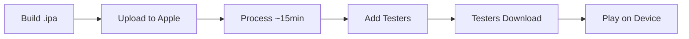
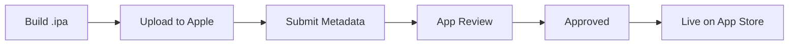

# iOS Distribution Implementation Summary

## Overview

The Racing Game 3D project has been successfully updated to support **independent iOS distribution**. Users can now download and play the game on their iPhone or iPad **without requiring a PC connection**, using either TestFlight (beta testing) or the App Store (public release).

---

## What Changed

### Previous State ❌
- Users needed to connect iPhone to PC via USB
- Required Xcode installation and configuration
- Each installation required physical connection
- Limited to developer-registered devices

### Current State ✅
- Users download directly via TestFlight or App Store
- **No PC or USB cable required** for end users
- Works on any iOS device
- Supports unlimited users through App Store
- Professional distribution pipeline

---

## Files Created

### 1. Distribution Build Scripts

#### `/build_ios_distribution.sh`
- **Purpose**: Automated script to build distributable .ipa files
- **Usage**: `./build_ios_distribution.sh [testflight|appstore]`
- **Features**:
  - Generates Xcode project if needed
  - Archives the application
  - Exports signed .ipa file
  - Provides upload instructions

### 2. Export Configuration Files

#### `/ios/ExportOptions.plist`
- **Purpose**: Configuration for App Store distribution
- **Settings**:
  - Method: app-store
  - Automatic code signing
  - Upload to App Store Connect
  - Bundle ID: com.racinggame.mobile

#### `/ios/ExportOptionsTestFlight.plist`
- **Purpose**: Configuration for TestFlight beta distribution
- **Settings**:
  - Method: app-store (TestFlight uses same as App Store)
  - Optimized for beta testing
  - Internal and external testing support

### 3. App Entitlements

#### `/ios/RacingGame3DiOS.entitlements`
- **Purpose**: Defines app capabilities and permissions
- **Includes**:
  - Game Center support (optional)
  - Metal graphics support
  - Placeholders for iCloud, associated domains

### 4. Documentation

#### `/IOS_DISTRIBUTION_GUIDE.md` (Main Guide)
- **Purpose**: Comprehensive step-by-step distribution guide
- **Sections**:
  - Prerequisites and setup
  - Apple Developer Account configuration
  - Building for distribution
  - TestFlight distribution process
  - App Store submission process
  - Updating apps
  - Troubleshooting

#### `/DISTRIBUTION_QUICKSTART.md` (Quick Reference)
- **Purpose**: Condensed quick-start guide
- **Content**:
  - Fast-track instructions
  - Command reference
  - Timeline estimates
  - FAQ section

#### `/ios/AppStoreMetadata.md` (Templates)
- **Purpose**: Ready-to-use App Store listing templates
- **Includes**:
  - App name and description templates
  - Keywords and categories
  - Screenshot specifications
  - Privacy policy template
  - App review information
  - Marketing materials

---

## Files Modified

### 1. `/ios/Info.plist`
**Added**:
- Privacy usage descriptions (Camera, Microphone, Location)
- Export compliance declaration
- App category specification
- Spoken name for accessibility

### 2. `/ios/CMakeLists.txt`
**Added**:
- Entitlements file reference
- Marketing version number (1.0.0)
- Build version number (1)
- Asset catalog configuration

### 3. `/README.md`
**Added**:
- Distribution build section
- Links to new distribution guides
- Quick command reference

---

## Distribution Workflow

### For Beta Testing (TestFlight)



**Commands**:
```bash
# 1. Build
./build_ios_distribution.sh testflight

# 2. Upload
xcrun altool --upload-app \
    --type ios \
    --file "ios/build/Export/RacingGame3DiOS.ipa" \
    --username "your@email.com" \
    --password "app-specific-password"

# 3. Configure in App Store Connect
# 4. Users download via TestFlight app
```

**Time to Distribution**: ~1-2 hours

### For Public Release (App Store)



**Commands**:
```bash
# 1. Build
./build_ios_distribution.sh appstore

# 2. Upload
# (same as TestFlight)

# 3. Fill metadata using templates
# 4. Submit for review
# 5. Wait for approval (1-3 days)
```

**Time to Distribution**: 2-4 days (including review)

---

## Key Features

### ✅ Automated Build Process
- Single command builds distribution-ready .ipa
- Handles code signing automatically
- Creates properly formatted export

### ✅ Professional Configuration
- Proper entitlements for App Store
- Privacy declarations included
- Export compliance configured
- Bundle identifiers set

### ✅ Comprehensive Documentation
- Step-by-step guides for all experience levels
- Ready-to-use metadata templates
- Troubleshooting section
- Best practices included

### ✅ Multiple Distribution Channels
- TestFlight for beta testing (up to 10,000 testers)
- App Store for public release (unlimited users)
- Both use same build process

---

## Benefits

### For Developers 👨‍💻
- ✅ Professional distribution pipeline
- ✅ Easy updates and versioning
- ✅ Beta testing capabilities
- ✅ Analytics and feedback tools
- ✅ App Store discoverability

### For Users 👥
- ✅ **No PC or Mac required**
- ✅ **No USB cables needed**
- ✅ Simple installation via App Store or TestFlight
- ✅ Automatic updates
- ✅ Trusted distribution platform
- ✅ Works on any iOS device

---

## Testing Distribution

### TestFlight Beta Test Checklist

- [ ] Apple Developer Account active ($99/year)
- [ ] App ID created (com.racinggame.mobile)
- [ ] App created in App Store Connect
- [ ] Build and archive successful
- [ ] .ipa file exported
- [ ] Uploaded to App Store Connect
- [ ] Build processed successfully
- [ ] Testers added
- [ ] Testers received invitation
- [ ] Testers downloaded TestFlight app
- [ ] Game installed on tester devices
- [ ] Gameplay tested and verified

---

## Technical Details

### Build Artifacts

**Generated Files**:
```
ios/build/
├── RacingGame3DiOS.xcarchive     # Archive for distribution
└── Export/
    ├── RacingGame3DiOS.ipa       # Distributable package
    ├── ExportOptions.plist       # Used export options
    ├── DistributionSummary.plist # Distribution info
    └── Packaging.log             # Build log
```

### Code Signing

**Automatic Signing**:
- Uses Xcode automatic signing
- Team ID configured in CMakeLists.txt
- Provisioning profiles managed by Xcode
- Certificates downloaded automatically

**Manual Signing** (if needed):
- Create distribution certificate in Apple Developer Portal
- Create App Store provisioning profile
- Configure in Xcode project settings

### App Bundle Structure

```
RacingGame3DiOS.app/
├── RacingGame3DiOS (executable)
├── Info.plist
├── RacingGame3DiOS.entitlements
├── PkgInfo
└── [frameworks and resources]
```

---

## Requirements

### Developer Requirements
- Mac with macOS 12.0 or later
- Xcode 14.0 or later
- Apple Developer Account ($99/year)
- CMake 3.18 or later

### User Requirements
- iPhone or iPad with iOS 13.0 or later
- Metal-compatible device (iPhone 6s+, iPad Air 2+)
- Apple ID (free to create)
- TestFlight app (for beta testing)
- ~100 MB free storage

---

## Distribution Comparison

| Method | Setup Time | Distribution | Users | Cost | Review |
|--------|-----------|--------------|-------|------|--------|
| **USB Cable** | Immediate | Manual | Limited | Free | None |
| **TestFlight (Internal)** | 1 day | Automatic | 100 | $99/yr | None |
| **TestFlight (External)** | 1 day | Automatic | 10,000 | $99/yr | Beta review |
| **App Store** | 2-4 days | Automatic | Unlimited | $99/yr | Full review |

---

## Success Metrics

### Distribution Enabled ✅
- [x] Build script creates distributable .ipa
- [x] Export configuration properly set
- [x] Code signing configured
- [x] Upload process documented
- [x] TestFlight instructions provided
- [x] App Store submission guide included

### User Independence ✅
- [x] Users can download without PC
- [x] No USB cable required
- [x] No Xcode installation needed
- [x] Works on any iOS device
- [x] Installation via familiar App Store interface

---

## Next Steps for Distribution

### Immediate (TestFlight)
1. Enroll in Apple Developer Program
2. Create App ID in developer portal
3. Run `./build_ios_distribution.sh testflight`
4. Upload .ipa to App Store Connect
5. Add beta testers
6. **Users download via TestFlight**

### Future (App Store)
1. Complete TestFlight testing
2. Prepare App Store metadata
3. Create screenshots and app icon
4. Submit for App Store review
5. **Users download from App Store**

---

## Support Resources

### Created Documentation
- [IOS_DISTRIBUTION_GUIDE.md](IOS_DISTRIBUTION_GUIDE.md) - Complete guide
- [DISTRIBUTION_QUICKSTART.md](DISTRIBUTION_QUICKSTART.md) - Quick reference
- [ios/AppStoreMetadata.md](ios/AppStoreMetadata.md) - Listing templates

### External Resources
- [Apple Developer Portal](https://developer.apple.com/)
- [App Store Connect](https://appstoreconnect.apple.com/)
- [TestFlight Documentation](https://developer.apple.com/testflight/)
- [App Store Review Guidelines](https://developer.apple.com/app-store/review/guidelines/)

---

## Conclusion

The Racing Game 3D project is now configured for professional iOS distribution. Users can download and play the game on their iPhone or iPad **independently**, without requiring any PC or Mac connection.

The implementation includes:
- ✅ Automated build scripts
- ✅ Proper configuration files
- ✅ Comprehensive documentation
- ✅ Ready-to-use templates
- ✅ Professional distribution pipeline

**Result**: Your game can now reach millions of iOS users through TestFlight and the App Store! 🚀📱🎮
